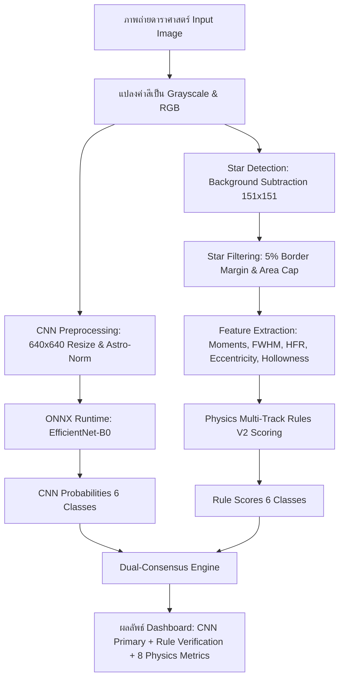

# เอกสารทางเทคนิค: ระบบตรวจประเมินคุณภาพภาพถ่ายดาราศาสตร์อัตโนมัติ
## (Astronomical Image Quality Inspection & Diagnostic Consensus Engine)

---

## 📑 สารบัญ (Table of Contents)
1. [ภาพรวมของระบบและสถาปัตยกรรม (System Architecture Overview)](#1-ภาพรวมของระบบและสถาปัตยกรรม)
2. [การจำแนกคุณภาพภาพถ่าย 6 คลาส (The 6 Quality Classes)](#2-การจำแนกคุณภาพภาพถ่าย-6-คลาส)
3. [อัลกอริทึมการประมวลผลภาพและการคำนวณสมการฟิสิกส์ (Computer Vision & Mathematical Formulations)](#3-อัลกอริทึมการประมวลผลภาพและการคำนวณสมการฟิสิกส์)
   - 3.1 การประมาณค่าสัญญาณรบกวนและพื้นหลัง (Background & Robust Noise MAD)
   - 3.2 การตรวจจับดาวและการกรองพื้นที่ขอบภาพ (Star Detection & Border Margin Exclusion)
   - 3.3 การวัดรูปร่างดาวและพารามิเตอร์ทางดาราศาสตร์ (Point Spread Function & MaxIm DL Metrics)
     - Full Width at Half Maximum (FWHM)
     - Half Flux Radius (HFR)
     - Eccentricity (ความรีของดาว)
     - Aspect Ratio & Circularity
     - Hollowness Ratio (อัตราความกลวงของโดนัท)
   - 3.4 การหาทิศทางและความสอดคล้องเชิงมุม (Axial Angle Consistency & Circular Statistics)
   - 3.5 การตรวจจับเส้นแสงดาวเทียม (Satellite Trail Detection)
   - 3.6 การตรวจจับปรากฏการณ์อิ่มตัวและแถบแสงล้น (Blooming Bar & Projection Difference)
   - 3.7 ความคมชัดของภาพ (Image Sharpness / Tenengrad)
4. [เอนจินกฎฟิสิกส์หลายมิติ V2 (Physics Multi-Track Rule Engine)](#4-เอนจินกฎฟิสิกส์หลายมิติ-v2)
   - 4.1 ฟังก์ชันเกณฑ์คะแนนพื้นฐาน (Membership & Ramp Scoring Functions)
   - 4.2 กฎการให้คะแนนแต่ละคลาสและสมการเงื่อนไข (Detailed Class Rules & Gating Logic)
5. [ระบบปัญญาประดิษฐ์โครงข่ายประสาทเทียม (Deep Learning CNN Pipeline)](#5-ระบบปัญญาประดิษฐ์โครงข่ายประสาทเทียม)
   - 5.1 สถาปัตยกรรม EfficientNet-B0 ONNX
   - 5.2 การเตรียมข้อมูลภาพและการปรับมาตรฐานค่าสี (Astronomy Image Normalization)
   - 5.3 การคำนวณความน่าจะเป็น (Softmax Probability Distribution)
6. [กลไกฉันทามติและการตรวจทานร่วม (Dual-Consensus Diagnostic Fusion)](#6-กลไกฉันทามติและการตรวจทานร่วม)
7. [สถาปัตยกรรมเว็บแอปพลิเคชันและการเชื่อมต่อ (Web Application Architecture & API)](#7-สถาปัตยกรรมเว็บแอปพลิเคชันและการเชื่อมต่อ)

---

## 1. ภาพรวมของระบบและสถาปัตยกรรม

ระบบนี้ถูกออกแบบขึ้นเพื่อแก้ไขปัญหาการคัดกรองและประเมินคุณภาพของภาพถ่ายดาราศาสตร์ (FITS / PNG / TIFF) ที่ได้จากกล้องดูดาวอัตโนมัติ โดยผสานการทำงานระหว่าง:
1. **โมเดลปัญญาประดิษฐ์โครงข่ายประสาทเทียม (Deep Learning CNN)**: ทำหน้าที่เป็น **แกนหลักในการจำแนก (Primary Driver)** เพื่อเรียนรู้ฟีเจอร์เชิงลึกจากภาพถ่าย
2. **เอนจินกฎฟิสิกส์ดาราศาสตร์ V2 (Physics-Based Rules V2 Engine)**: ทำหน้าที่เป็น **ระบบตรวจสอบความถูกต้องและระบบป้องกันความผิดพลาด (Guardrail & Verifier)** ตามหลักการของโปรแกรมมาตรฐานดาราศาสตร์อย่าง MaxIm DL



---

## 2. การจำแนกคุณภาพภาพถ่าย 6 คลาส

| ลำดับ | รหัสคลาส (Class Name) | คำอธิบายลักษณะทางกายภาพ | ผลกระทบต่อการวิจัยดาราศาสตร์ |
| :---: | :--- | :--- | :--- |
| **01** | `01_Good` | ดาวเป็นจุดกลม คมชัด ไม่มีแสงล้น ค่า FWHM และ Eccentricity ต่ำ | ภาพสมบูรณ์ สามารถนำไปทำ Astrometry และ Photometry ได้ |
| **02** | `02_Out_of_Focus` | กล้องหลุดโฟกัส ดาวบวมขยายตัวเป็นวงกว้าง หรือเกิดวงแหวนโดนัท (Donut Defocus) | ค่า FWHM และ HFR สูงมาก สูญเสียรายละเอียด ไม่สามารถโฟกัสแสงได้ |
| **03** | `03_Tracking_Error` | ขาตั้งกล้องตามดาวผิดพลาด ดาวทุกดวงในเฟรมยืดรีขนานกันไปในทิศทางเดียวกัน | ค่า Eccentricity สูง และความสอดคล้องของมุม (Angle Consistency) สูง |
| **04** | `04_Over_Saturated` | แสงล้นเซนเซอร์ CCD (Full-well capacity เกิน) เกิดแถบแสงไหลแนวตั้ง/แนวนอน (Blooming Spike) | ข้อมูลช่วงแสงเสีย สูญเสียความเป็นเส้นตรง (Non-linear response) |
| **05** | `05_No_Star` | ท้องฟ้ามีเมฆบดบัง แผ่นปิดหน้ากล้องไม่เปิด หรือเวลาเปิดรับแสงสั้นเกินไปจนไม่พบดาว | จำนวนดาวในเฟรมน้อยมากหรือเป็นศูนย์ ไม่สามารถตรวจวัดตำแหน่งดาวได้ |
| **06** | `06_Satellite` | ดาวเทียมหรือขยะอวกาศโคจรตัดผ่านหน้ากล้องขณะเปิดรับแสง เกิดเป็นเส้นตรงพาดยาว | เกิดรอยเส้นสว่างพาดผ่านภาพ บดบังและรบกวนการวัดแสงของวัตถุท้องฟ้า |

---

## 3. อัลกอริทึมการประมวลผลภาพและการคำนวณสมการฟิสิกส์

### 3.1 การประมาณค่าสัญญาณรบกวนและพื้นหลัง (Background & Robust Noise MAD)
ในภาพดาราศาสตร์ ค่าเฉลี่ย ($\mu$) และส่วนเบี่ยงเบนมาตรฐานแบบเดิม ($\sigma$) จะถูกบิดเบือนได้ง่ายจากแสงดาวที่สว่างจ้า จึงต้องใช้ตัวประมาณค่าแบบทนทาน (Robust Estimator) ตามฟังก์ชัน `robust_mad()`:

1. **ค่ามัธยฐานพื้นหลัง (Background Median)**:
   $$B = \operatorname{median}(I)$$

2. **ค่าเบี่ยงเบนสัมบูรณ์มัธยฐาน (Median Absolute Deviation - MAD)**:
   $$\text{MAD} = \operatorname{median}\left( \left| I(x, y) - B \right| \right)$$

3. **การแปลงเป็นค่าประมาณส่วนเบี่ยงเบนมาตรฐาน (Noise Standard Deviation $\hat{\sigma}$)**:
   $$\hat{\sigma} = 1.4826 \times \text{MAD}$$
   *(ค่าคงที่ $1.4826 = \frac{1}{\Phi^{-1}(0.75)}$ เป็นค่าสำหรับแปลงค่าการแจกแจงแบบปกติ)*

---

### 3.2 การตรวจจับดาวและการกรองพื้นที่ขอบภาพ (Star Detection & Border Margin Exclusion)
การตรวจจับดาวทำงานในฟังก์ชัน `detect_star_contours_v2()` และ `extract_features_v2()`:

1. **การกำจัดพื้นหลังแบบหลายสเกล (Multi-Scale Background Flattening)**:
   ใช้ Gaussian Blur ขนาดเคอร์เนลขนาดใหญ่ $151 \times 151$ พิกเซล เพื่อเก็บรักษาทั้งดาวขนาดเล็กและดาว Out of Focus ที่บวมใหญ่:
   $$I_{\text{bg}} = G_{\sigma=0}(I) * K_{151\times151}$$
   $$I_{\text{diff}} = \max(0, I - I_{\text{bg}})$$

2. **เกณฑ์การแบ่งส่วนดาวแบบแปรผัน (Adaptive Thresholding)**:
   $$T = \max\left(\mu_{\text{diff}} + 1.8 \cdot \sigma_{\text{diff}}, 25.0\right)$$
   ตามด้วยการทำ Morphological Open ด้วยเคอร์เนลวงรีขนาด $3 \times 3$ เพื่อตัด Hot Pixel และ Cosmic Rays

3. **การตัดขอบภาพ (Star Selection Margin Exclusion - 5% Rule)**:
   เลนส์กล้องโทรทรรศน์มักมีความคลาดทางทัศนศาสตร์บริเวณขอบภาพ เช่น Coma และ Astigmatism ซึ่งทำให้ดาวที่ขอบดูรี ทั้งที่กล้องไม่ได้เคลื่อนที่ตามดาวผิดพลาด ระบบจึงคัดทิ้งดาวที่อยู่ในระยะขอบ:
   $$x \notin [0.05W, 0.95W] \quad \text{หรือ} \quad y \notin [0.05H, 0.95H]$$

4. **การกรองขนาดดาว (Area Filtering)**:
   $$5.0 \le \text{Area} \le 15,000 \text{ พิกเซล}$$

---

### 3.3 การวัดรูปร่างดาวและพารามิเตอร์ทางดาราศาสตร์ (Point Spread Function & MaxIm DL Metrics)
ฟังก์ชัน `measure_star_profile()` คำนวณคุณสมบัติของดาวแต่ละดวง:

#### ก. จุดศูนย์กลางมวลและโมเมนต์อันดับสอง (Centroid & 2nd Moments)
ตัดภาพเฉพาะบริเวณรอบดาว (Sub-pixel Patch) หักลบพื้นหลังที่ขอบออก ได้ความสว่างสัญญาณ $I_s(x, y) = \max(0, I(x, y) - B_{\text{patch}})$:
- **ฟลักซ์รวม (Total Flux)**:
  $$F = \sum_{x, y} I_s(x, y)$$
- **จุดศูนย์กลางมวล (Centroid)**:
  $$\bar{x} = \frac{\sum x \cdot I_s(x, y)}{F}, \quad \bar{y} = \frac{\sum y \cdot I_s(x, y)}{F}$$
- **โมเมนต์ศูนย์กลางอันดับสอง (Second Central Moments)**:
  $$\mu_{xx} = \frac{\sum (x - \bar{x})^2 I_s(x, y)}{F}, \quad \mu_{yy} = \frac{\sum (y - \bar{y})^2 I_s(x, y)}{F}, \quad \mu_{xy} = \frac{\sum (x - \bar{x})(y - \bar{y}) I_s(x, y)}{F}$$

#### ข. โคแวเรียนซ์และค่าไอเกน (Covariance Tensor & Eigenvalues)
เมทริกซ์ความแปรปรวนร่วมของรูปร่างดาว:
$$\mathbf{\Sigma} = \begin{bmatrix} \mu_{xx} & \mu_{xy} \\ \mu_{xy} & \mu_{yy} \end{bmatrix}$$
คำนวณค่าไอเกน $\lambda_1 \ge \lambda_2 \ge 0$ ซึ่งแสดงถึงการกระจายแสงตามแกนเอก (Major Axis) และแกนโท (Minor Axis):
$$\sigma_{\text{major}} = \sqrt{\lambda_1}, \quad \sigma_{\text{minor}} = \sqrt{\lambda_2}$$

#### ค. Full Width at Half Maximum (FWHM)
สำหรับสัญญาณเกาส์เซียน ค่าความกว้างครึ่งหนึ่งของค่าสูงสุดคำนวณจาก:
$$\text{FWHM}_{\text{major}} = 2\sqrt{2\ln 2} \cdot \sigma_{\text{major}} \approx 2.3548 \cdot \sigma_{\text{major}}$$
$$\text{FWHM}_{\text{minor}} \approx 2.3548 \cdot \sigma_{\text{minor}}$$
$$\text{FWHM} = \frac{\text{FWHM}_{\text{major}} + \text{FWHM}_{\text{minor}}}{2}$$

#### ง. Half Flux Radius (HFR)
เป็นดัชนีวัดโฟกัสที่เป็นมาตรฐานของโปรแกรมดาราศาสตร์ (เช่น MaxIm DL, N.I.N.A.):
$$\text{รัศมี } r_i = \sqrt{(x_i - \bar{x})^2 + (y_i - \bar{y})^2}$$
จัดเรียงพิกเซลตามระยะรัศมี $r_{(1)} \le r_{(2)} \le \dots \le r_{(n)}$ แล้วหาค่ารัศมีที่บรรจุฟลักซ์ครึ่งหนึ่ง:
$$\sum_{i=1}^{k} I_s(r_{(i)}) \ge 0.5 \times F \implies \text{HFR} = r_{(k)}$$

#### จ. ความรีของดาว (Eccentricity - $e$)
$$e = \sqrt{1 - \frac{\sigma_{\text{minor}}^2}{\sigma_{\text{major}}^2}} = \sqrt{1 - \frac{\lambda_2}{\lambda_1}}$$
*ค่า $e = 0.0$ หมายถึงดาวเป็นวงกลมสมบูรณ์ และ $e \to 1.0$ หมายถึงดาวถูกยืดออกเป็นเส้นรี*

#### ฉ. Aspect Ratio & Circularity
- **Aspect Ratio ($AR$)**: คำนวณจากการฟิตวงรี (`cv2.fitEllipse`):
  $$AR = \frac{d_{\text{major}}}{d_{\text{minor}}}$$
- **Circularity ($C$)**: วัดความเป็นวงกลมจากเส้นรอบรูป ($P$) และพื้นที่ ($A$):
  $$C = \frac{4\pi A}{P^2} \quad (C \in (0, 1])$$

#### ช. อัตราส่วนความกลวงของโดนัท (Hollowness Ratio - $H$)
ในกล้องดูดาวแบบสะท้อนแสง (เช่น Cassegrain, Ritchey-Chrétien) เมื่อภาพหลุดโฟกัส เงาของกระจกทุติยภูมิ (Secondary Mirror) จะบังแสงตรงกลางดาว ทำให้เกิดรูป "โดนัท":
$$H = \operatorname{clamp}\left(1.0 - \frac{I(\bar{x}, \bar{y})}{\max_{(x,y) \in \text{contour}} I(x, y)}\right)$$
*หากดาวมีขอบสว่างแต่ตรงกลางมืด ค่า $H$ จะพุ่งสูงเข้าใกล้ $1.0$*

---

### 3.4 การหาทิศทางและความสอดคล้องเชิงมุม (Axial Angle Consistency & Circular Statistics)
ปัญหา **Tracking Error** เกิดจากการที่มอเตอร์ตามดาวของกล้องมีความผิดพลาด ทำให้ดาว**ทุกดวงในภาพถูกลากเป็นเส้นรีที่ขนานกันไปในทิศทางเดียวกันทั้งหมด**

ฟังก์ชัน `compute_axial_consistency()` คำนวณความสอดคล้องเชิงมุมโดยใช้สถิติวงกลม (Circular Directional Statistics):
1. มุมการเอียงของวงรีดาวแต่ละดวง $\theta_j \in [0^\circ, 180^\circ)$
2. เนื่องจากแกนรีไม่มีทิศหัวท้าย ($\theta \equiv \theta + 180^\circ$) จึงต้องคูณมุมด้วย 2 (Doubling Angles):
   $$\phi_j = 2\theta_j$$
3. คำนวณเวกเตอร์ผลลัพธ์เฉลี่ย (Mean Resultant Vector):
   $$\bar{C} = \frac{1}{N}\sum_{j=1}^N \cos(\phi_j), \quad \bar{S} = \frac{1}{N}\sum_{j=1}^N \sin(\phi_j)$$
4. **ความสอดคล้องของแกน (Axial Consistency $R$)**:
   $$R = \sqrt{\bar{C}^2 + \bar{S}^2} \quad (R \in [0.0, 1.0])$$
   *ถ้าดาวทุกดวงเอียงไปทางเดียวกันเป๊ะ $R = 1.0$ ถ้าดาวเอียงสะเปะสะปะสุ่มทิศ $R \to 0.0$*
5. **ส่วนเบี่ยงเบนมาตรฐานของมุม (Circular Angular Standard Deviation $\sigma_\theta$)**:
   $$\sigma_\theta = \frac{1}{2} \sqrt{-2 \ln R} \quad (\text{เรเดียน})$$

---

### 3.5 การตรวจจับเส้นแสงดาวเทียม (Satellite Trail Detection)
ฟังก์ชัน `detect_satellite_streaks_v2()`:
1. กำหนดเกณฑ์แยกวัตถุเส้นแสง:
   $$T_{\text{streak}} = \min(B + \max(2.5 \cdot \text{MAD}, 12.0), 250.0)$$
2. ทำการเชื่อมรอยต่อเส้นที่ขาดด้วย Morphological Close เคอร์เนลสี่เหลี่ยม $3 \times 3$
3. กรองคอนทัวร์ที่มีความยาวพิกเซล $L \ge 120$ px และ Aspect Ratio $\ge 4.5$
4. คำนวณอัตราส่วนความยาวเส้นต่อเส้นทแยงมุมของภาพ:
   $$\text{Max Streak Length Ratio} = \frac{L_{\max}}{\sqrt{W^2 + H^2}}$$

---

### 3.6 การตรวจจับปรากฏการณ์อิ่มตัวและแถบแสงล้น (Blooming Bar & Projection Difference)
เมื่อเกิด **Over Saturated** บนเซนเซอร์แบบ CCD หลุมศักย์ของพิกเซลจะเต็ม (Well Saturation) และประจุอิเล็กตรอนจะล้นทะลักออกตามแนวคอลัมน์อ่านข้อมูล (Vertical/Horizontal Bleeding):

ฟังก์ชันคำนวณการฉายโปรเจกชัน 1 มิติ (1D Mean Projection Profile):
$$P_{\text{row}}(y) = \frac{1}{W} \sum_{x=0}^{W-1} I(x, y), \quad P_{\text{col}}(x) = \frac{1}{H} \sum_{y=0}^{H-1} I(x, y)$$
$$\text{Max Projection Diff} = \max\left( \max(P_{\text{row}}) - \operatorname{median}(P_{\text{row}}), \max(P_{\text{col}}) - \operatorname{median}(P_{\text{col}}) \right)$$
*หากเกิด Blooming Bar แนวนอนหรือแนวตั้ง ค่าส่วนต่างนี้จะสูงเกิน $50.0$*

---

### 3.7 ความคมชัดของภาพ (Image Sharpness / Tenengrad)
วัดการเปลี่ยนแปลงความชันของขอบภาพโดยใช้ Laplacian Operator:
$$\nabla^2 I = \frac{\partial^2 I}{\partial x^2} + \frac{\partial^2 I}{\partial y^2}$$
$$\text{Sharpness} = \operatorname{Var}\left( \nabla^2 I \right)$$

---

## 4. เอนจินกฎฟิสิกส์หลายมิติ V2 (Physics Multi-Track Rule Engine)

### 4.1 ฟังก์ชันเกณฑ์คะแนนพื้นฐาน (Membership & Ramp Scoring Functions)

1. **ฟังก์ชันค่าน้อยได้คะแนนสูง (`score_low`)**:
   $$S_{\text{low}}(x; a, b) = \operatorname{clamp}\left(\frac{b - x}{b - a}\right) = \begin{cases} 1.0, & x \le a \\ \frac{b - x}{b - a}, & a < x < b \\ 0.0, & x \ge b \end{cases}$$

2. **ฟังก์ชันค่ามากได้คะแนนสูง (`score_high`)**:
   $$S_{\text{high}}(x; a, b) = \operatorname{clamp}\left(\frac{x - a}{b - a}\right) = \begin{cases} 0.0, & x \le a \\ \frac{x - a}{b - a}, & a < x < b \\ 1.0, & x \ge b \end{cases}$$

3. **ฟังก์ชันรวมน้ำหนัก (Weighted Mean)**:
   $$\bar{S} = \frac{\sum_i w_i \cdot S_i}{\sum_i w_i}$$

---

### 4.2 กฎการให้คะแนนแต่ละคลาสและสมการเงื่อนไข (Detailed Class Rules & Gating Logic)

#### 1. คลาส `01_Good` (`score_good_v2`)
* **เกณฑ์หลัก**:
  $$S_{\text{base}} = \text{WeightedMean}\left(\begin{array}{ll}
  S_{\text{low}}(\text{FWHM}, 17.0, 32.0), & w=1.8 \\
  S_{\text{low}}(\text{Eccentricity}, 0.38, 0.58), & w=1.6 \\
  S_{\text{high}}(\text{Circularity}, 0.60, 0.85), & w=1.2 \\
  S_{\text{high}}(\text{Sharpness}, 6000, 35000), & w=1.5 \\
  S_{\text{high}}(\text{StarCount}, 3, 25), & w=0.8 \\
  S_{\text{low}}(\text{SaturatedRatio}, 0.010, 0.040), & w=1.0 \\
  S_{\text{low}}(\text{MeanHollowness}, 0.008, 0.04), & w=1.2
  \end{array}\right)$$
* **ประตูกั้น (Gating Logic)**:
  - หากดาวบวม ($\text{Area} > 115$) หรือกลวง ($\text{Hollowness} > 0.05$) $\implies$ ปรับลดเหลือ $0.10$
  - หากพบดาวยืดขนานกัน ($\text{ElongatedCount} \ge 5$, Ratio $> 0.35$, Consistency $> 0.45$) $\implies$ คูณบทลงโทษ $\times 0.25$
  - หากพบเส้นแสงดาวเทียม $\implies$ คูณบทลงโทษ $\times 0.15$
  - หากพบ Blooming Bar ($\text{MaxProjectionDiff} \ge 50$) $\implies$ คูณบทลงโทษ $\times 0.15$

#### 2. คลาส `02_Out_of_Focus` (`score_out_of_focus_v2`)
ใช้สถาปัตยกรรมสองแทร็ก (Two-Track Architecture):
* **Track A (Donut Signature)**:
  $$S_{\text{donut}} = \text{WeightedMean}\left(\begin{array}{ll}
  S_{\text{high}}(\text{MeanHollowness}, 0.04, 0.12), & w=2.5 \\
  S_{\text{high}}(\text{FWHM}, 18.0, 35.0), & w=1.2 \\
  S_{\text{low}}(\text{Eccentricity}, 0.35, 0.60), & w=1.0
  \end{array}\right)$$
* **Track B (Swollen Star Signature)**:
  $$S_{\text{swollen}} = \text{WeightedMean}\left(\begin{array}{ll}
  S_{\text{high}}(\text{MeanArea}, 115.0, 240.0), & w=2.5 \\
  S_{\text{high}}(\text{FWHM}, 32.0, 48.0), & w=2.0 \\
  S_{\text{high}}(\text{HFR}, 14.0, 24.0), & w=1.5 \\
  S_{\text{low}}(\text{Eccentricity}, 0.30, 0.55), & w=1.5 \\
  S_{\text{low}}(\text{SaturatedRatio}, 0.005, 0.030), & w=1.2
  \end{array}\right)$$
* **คะแนนสุทธิ**: $S_{\text{OOF}} = \max(S_{\text{donut}}, S_{\text{swollen}})$
* **Anti-TE Gate**: หากดาวรีมาก ($e > 0.55$) และทิศทางขนานกัน ($R > 0.55$) แสดงว่าเป็น Tracking Error ไม่ใช่ Out of Focus $\implies$ คูณ $\times 0.20$

#### 3. คลาส `03_Tracking_Error` (`score_tracking_error_v2`)
* **เกณฑ์รูปร่าง (Shape Score)**:
  $$S_{\text{shape}} = \text{WeightedMean}\left(\begin{array}{ll}
  S_{\text{high}}(\text{Eccentricity}, 0.42, 0.75), & w=1.8 \\
  S_{\text{high}}(\text{Aspect Ratio}, 1.22, 1.55), & w=2.2 \\
  S_{\text{high}}(\text{Elongated Star Ratio}, 0.22, 0.55), & w=2.0 \\
  S_{\text{high}}(\text{Max Aspect Ratio}, 1.60, 4.0), & w=1.0
  \end{array}\right)$$
* **เกณฑ์ความสอดคล้องเชิงมุม (Consensus Score)**:
  $$S_{\text{cons}} = S_{\text{high}}(\text{Axial Consistency } R, 0.22, 0.58)$$
* **การรวมคะแนนแบบเรขาคณิต**:
  $$S_{\text{TE}} = \text{WeightedMean}([S_{\text{shape}} \times 2.2, S_{\text{cons}} \times 2.0]) \times S_{\text{high}}(\text{ElongatedCount}, 2, 6)$$
* **ประตูกั้นยกเว้น**: หากดาวยืดเป็นเส้นยาวมาก ($AR > 1.45$) เกณฑ์ความสอดคล้องจะถูกผ่อนปรนให้ผ่านทันที

#### 4. คลาส `04_Over_Saturated` (`score_over_saturated_v2`)
ใช้สถาปัตยกรรมสามแทร็ก (Three-Track Architecture):
* **Track 1 (Massive CCD Blooming Bar)**: ตรวจจับเมื่อ $\text{MaxProjectionDiff} \ge 50.0$
* **Track 2 (Normalized Full-Well Saturation)**: ตรวจจับเมื่อภาพถูก Normalize มาจนค่าสูงสุดตันที่ $\le 165.0$, มีจำนวนดาว $\ge 10$ และพื้นหลังมืด $\le 25.0$
* **Track 3 (High-Contrast Saturated Spikes)**: ตรวจจับดาวที่มีแกนอิ่มตัวเต็มที่ $\text{SaturatedRatio} \ge 0.003$ ร่วมกับค่าพิกเซลสูงสุด $255.0$

#### 5. คลาส `05_No_Star` (`score_no_star_v2`)
* ตรวจจับเมื่อจำนวนดาวเข้าใกล้ 0:
  $$S_{\text{NoStar}} = \text{WeightedMean}\left(\begin{array}{ll}
  S_{\text{low}}(\text{StarCount}, 0, 4), & w=2.5 \\
  S_{\text{low}}(\text{ValidProfileCount}, 0, 3), & w=1.8 \\
  S_{\text{low}}(\text{BrightAreaRatio}, 0.001, 0.008), & w=1.0 \\
  S_{\text{low}}(\text{StdIntensity}, 5.0, 18.0), & w=0.8
  \end{array}\right)$$
* **Sharp Star Gate**: หากพบดาวคมชัดเพียงดวงเดียว ($5 < \text{FWHM} < 28$ และ $\text{Sharpness} > 6000$) $\implies$ ปรับลดคะแนนลง $\times 0.35$

#### 6. คลาส `06_Satellite` (`score_satellite_v2`)
* หากพบเส้นยาวชัดเจน ($\text{MaxStreakLengthRatio} \ge 0.25$ และ $\text{Aspect} \ge 10.0$) $\implies$ ให้คะแนนขั้นต่ำ $0.88$ ทันที
* หากเป็นเส้นระดับปานกลาง รวมคะแนนจาก:
  $$S_{\text{Sat}} = \text{WeightedMean}\left(\begin{array}{ll}
  S_{\text{high}}(\text{StreakCount}, 0.8, 2.0), & w=1.5 \\
  S_{\text{high}}(\text{StreakLengthRatio}, 0.12, 0.50), & w=2.5 \\
  S_{\text{high}}(\text{StreakAspectRatio}, 4.5, 18.0), & w=2.0 \\
  S_{\text{low}}(\text{SaturatedRatio}, 0.02, 0.08), & w=0.6
  \end{array}\right)$$

---

## 5. ระบบปัญญาประดิษฐ์โครงข่ายประสาทเทียม (Deep Learning CNN Pipeline)

### 5.1 สถาปัตยกรรม EfficientNet-B0 ONNX
โมเดลที่ใช้คือ `eff_b0_kfold_add_focal_r2.onnx`:
- **Backbone**: EfficientNet-B0 (Compound Scaling สำหรับ Depth, Width, Resolution)
- **Loss Function ตอนเทรน**: Focal Loss เพื่อแก้ปัญหา Class Imbalance ในภาพดาราศาสตร์
- **Output**: 6 โหนด สำหรับความน่าจะเป็นของแต่ละคลาส

### 5.2 การเตรียมข้อมูลภาพและการปรับมาตรฐานค่าสี (Astronomy Image Normalization)
จุดสำคัญที่สุดของระบบคือ **ต้องใช้ค่าทางสถิติเฉพาะของชุดข้อมูลดาราศาสตร์** (ไม่ใช่ ImageNet ทั่วไป):
1. ย่อ/ขยายภาพเป็นขนาด $640 \times 640$ พิกเซลด้วยการประมาณค่าเชิงเส้น (`cv2.INTER_LINEAR`)
2. แปลงสเปซสี BGR $\to$ RGB
3. แปลงช่วงพิกเซลเป็น $[0.0, 1.0]$:
   $$X_{\text{norm}} = \frac{I_{\text{RGB}}}{255.0}$$
4. **มาตรฐานสถิติดาราศาสตร์ (Astro Normalization Formula)**:
   $$\hat{X}_c = \frac{X_{\text{norm}, c} - \mu_{\text{astro}}}{\sigma_{\text{astro}}}$$
   โดยที่:
   $$\mu_{\text{astro}} = 0.353340744972229$$
   $$\sigma_{\text{astro}} = 0.13850915431976318$$
5. จัดเรียงมิติข้อมูลเข้าสู่ Tensor: $[1, 3, 640, 640]$ ในรูปแบบ NCHW

### 5.3 การคำนวณความน่าจะเป็น (Softmax Probability Distribution)
ค่า Logits ผลลัพธ์ $z_k$ ($k=1,\dots,6$) จาก ONNX Runtime จะถูกแปลงเป็นความน่าจะเป็นด้วยฟังก์ชัน Softmax ที่ป้องกัน Numerical Overflow:
$$P(y = k \mid I) = \frac{\exp\left(z_k - \max_j z_j\right)}{\sum_{j=1}^6 \exp\left(z_j - \max_j z_j\right)}$$

---

## 6. กลไกฉันทามติและการตรวจทานร่วม (Dual-Consensus Diagnostic Fusion)

ระบบใช้สถาปัตยกรรมการตัดสินใจแบบสองชั้น:
1. **คำทำนายหลัก (Primary Classification)**:
   $$C_{\text{CNN}} = \arg\max_{k \in \{1,\dots,6\}} P_k$$
   $$\text{Confidence}_{\text{CNN}} = P\left(y = C_{\text{CNN}}\right)$$
2. **การวินิจฉัยทางฟิสิกส์ (Physics Verification)**:
   $$C_{\text{Rule}} = \arg\max_{k \in \{1,\dots,6\}} S_k$$
   $$\text{Score}_{\text{Rule}} = S(C_{\text{Rule}})$$
3. **สถานะฉันทามติ (Consensus Status)**:
   $$\text{Consensus} = \begin{cases} \mathbf{MATCH}, & \text{เมื่อ } C_{\text{CNN}} = C_{\text{Rule}} \\ \mathbf{DISAGREE}, & \text{เมื่อ } C_{\text{CNN}} \ne C_{\text{Rule}} \end{cases}$$

> **ประโยชน์ในทางปฏิบัติ**: เมื่อเกิด `DISAGREE` ระบบจะขึ้นแถบสีส้มแจ้งเตือนให้นักดาราศาสตร์เข้ามาตรวจสอบด้วยสายตา (Manual Audit) ทันที ช่วยลด False Positive จาก AI และปิดช่องโหว่ Edge Case ได้อย่างแม่นยำ

---

## 7. สถาปัตยกรรมเว็บแอปพลิเคชันและการเชื่อมต่อ (Web Application Architecture & API)

ระบบเว็บแอปพลิเคชันทำงานแบบ Client-Server Architecture ในโฟลเดอร์ `astro_web_app/`:

### แผนผังไฟล์ในระบบ:
- `server.py` : Flask Server, In-memory ONNX Preloading, API Endpoints
- `astro_pipeline_v2.py` : เอนจินกฎฟิสิกส์ V2 และการคำนวณฟังก์ชันสถิติดาว
- `astro_rule_classifier_new.py` : คลังฟังก์ชัน Open/Computer Vision พื้นฐาน
- `eff_b0_kfold_add_focal_r2.onnx` : ไฟล์น้ำหนักโมเดล CNN
- `static/index.html` : โครงสร้างหน้าเว็บ Dashboard (รองรับ Drag & Drop และ Modal)
- `static/style.css` : ชุดตกแต่งธีมสี Teal พร้อม Custom Scrollbar
- `static/script.js` : ตัวจัดการคิวประมวลผล, Canvas ซูม/ลากภาพ, กราฟ Bar Chart และ Export ZIP/CSV

### API Specifications:
- **`GET /api/health`**: ตรวจสอบสถานะการเชื่อมต่อและสถานะการโหลดโมเดล ONNX
- **`POST /api/analyze`**: รับไฟล์ภาพผ่าน Multipart Form-data และส่งกลับผลลัพธ์เป็น JSON ทันที (เวลาประมวลผลเฉลี่ย ~30-50ms ต่อภาพ):

```json
{
  "filename": "star_frame.png",
  "dimensions": { "width": 1024, "height": 1024 },
  "status": "SUCCESS",
  "consensus": "MATCH",
  "cnn_model": {
    "available": true,
    "predicted_class": "01_Good",
    "confidence_pct": 89.45,
    "probabilities_pct": {
      "01_Good": 89.45,
      "02_Out_of_Focus": 2.15,
      "03_Tracking_Error": 4.10,
      "04_Over_Saturated": 1.20,
      "05_No_Star": 0.80,
      "06_Satellite": 2.30
    }
  },
  "rule_based": {
    "top_class": "01_Good",
    "top_score_pct": 84.12,
    "scores": { ... }
  },
  "physics_metrics": {
    "star_count": 42,
    "median_fwhm": 18.25,
    "median_eccentricity": 0.312,
    "mean_circularity": 0.785,
    "mean_hollowness": 0.002,
    "saturated_ratio": 0.0012,
    "sharpness": 28450.0,
    "mean_aspect_ratio": 1.12
  }
}
```
